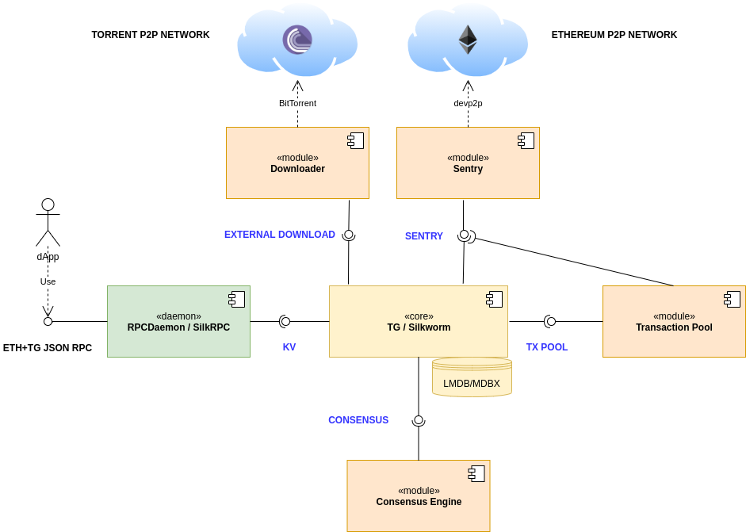

# Interfaces

gRPC services of [Erigon](https://github.com/erigontech/erigon) and [Silkworm](https://github.com/erigontech/silkworm).

[Components description](./_docs/README.md)




## Integration into other repositories

Using a go module is the most effective way to include these definitions in consuming repos.

``` 
go get github.com/erigontech/interfaces
```

This makes local development easier as go.mod redirect can be used, and saves on submodule/tree updates (which were the previous method of consumption).


## Style guide 

[https://developers.google.com/protocol-buffers/docs/style](https://developers.google.com/protocol-buffers/docs/style)
