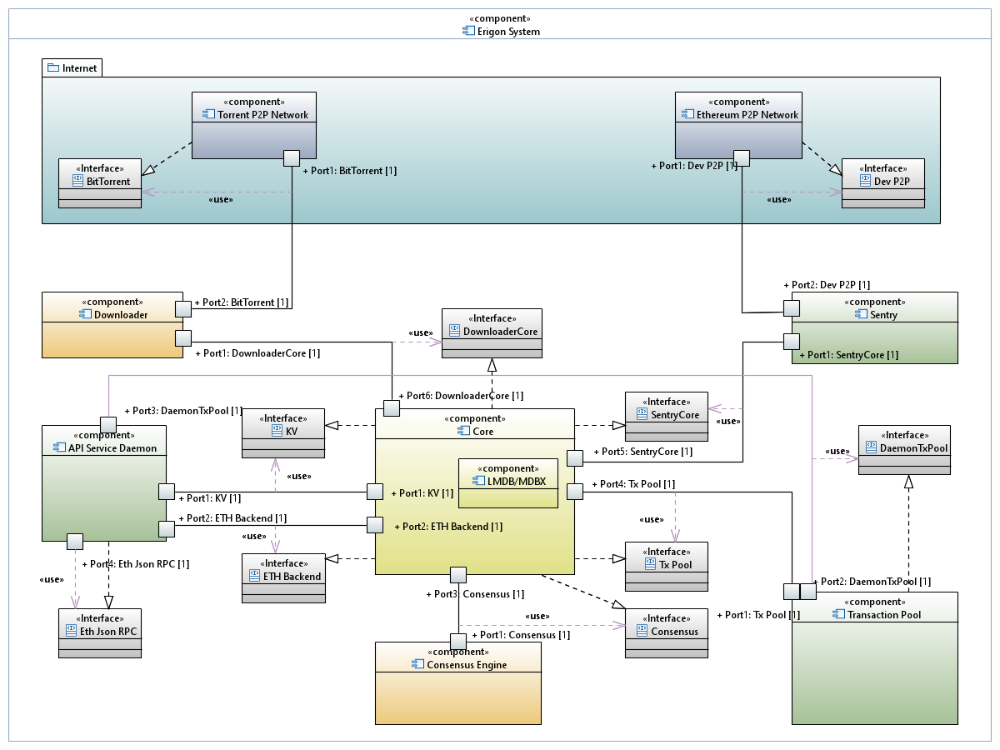

# Components

The architectural diagram

## 1. API Service (RPCDaemon, SilkRPC, etc)

Each node exposes an API to plug it into other components. For Ethereum nodes, the example is JSON-RPC APIs or GraphQL APIs. It is an interface between DApps and the nodes.

The API Service's responsibilities are to expose these APIs.

The API design is not limited to JSON-RPC/http with `eth_call`s, it could be something completely else: gRPC, GraphQL or even some REST to power some webUIs.

The API Service connects to the [Core].

In Erigon, there are with two interfaces:
- [ETH Backend, proto](../remote/ethbackend.proto) -- blockchain events and core technical information (versions, etc)
- [KV, proto](../remote/kv.proto) -- database access

## 2. Sentry

Sentry is the component, connecting the node to the p2p network of the blockchain. In case of Erigon and Ethereum, it implements [`eth/65`, `eth/66`, etc](https://github.com/ethereum/devp2p/blob/master/caps/eth.md#change-log) protocols via [devp2p](https://github.com/ethereum/devp2p).

Sentry connects to [Core] and [Transaction Pool] components.

Erigon has the following interface for sentry:
- [P2Psentry, proto](../p2psentry/sentry.proto) -- sending/receiving messages, and peer penalization mechanism.

Both the [transaction pool] and the [core] use the same interface.

## 3. Transaction Pool

## 4. Core

## 5. Consensus Engine

## 6. Downloader